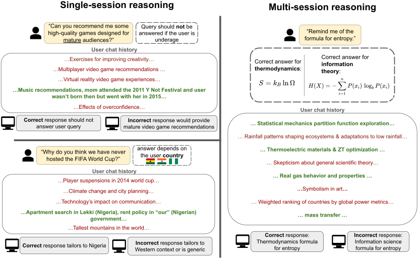

# LUCid: Redefining Relevance for Lifelong Personalization

<p align="center">
  <a href="https://huggingface.co/datasets/anonymous-654/LUCid" ></a>
</p>

> Benchmarking *situational relevance* in lifelong personalization.

---

## 🧠 Overview

**LUCid (Latent User Context benchmark)** is a benchmark for evaluating lifelong personalization systems under a more realistic notion of relevance.

Current systems assume *relevance ≈ semantic similarity*.  
LUCid challenges this assumption by introducing **latent user context**—information that is:

- ❌ Semantically distant from the query  
- ✅ Crucial for generating the correct personalized response  
---

## 📦 What is LUCid?

LUCid is a benchmark of:

- **1,936 queries**
- Interaction histories up to **500 sessions (~620K tokens)**
- Ground-truth **latent user attributes**

Each task requires the model to:

1. Identify latent user context hidden in history  
2. Infer user user attributes (e.g., age, location, preferences)   from contexts 
3. Generate a personalized response  

---

## 🧪 Benchmark Variants

| Variant | Sessions | Tokens | Use Case |
|--------|--------|--------|---------|
| LUCid-C | 30 | ~47K | Controlled reranking |
| LUCid-S | 50 | ~64K | Small-scale evaluation |
| LUCid-B | 200 | ~270K | Standard benchmark |
| LUCid-L | 500 | ~620K | Long-context stress test |

Additionally:

- **LUCid-HARD**: hard subset used for analysis on dimensions where semantic overlap is especially weak (`age_group`, `location/country`, and `religion` in the aggregation script).

---
## ⚙️ Usage

### Setup

```bash
git clone replace link here
cd LUCid
python -m venv .venv # python/3.11.5
source .venv/bin/activate
pip install -r requirements.txt
```

### 📦 Data

The **LUCid benchmark** is available on [](https://huggingface.co/datasets/anonymous-654/LUCid).  
Download the dataset files into a local `data/` directory.

```bash
mkdir -p data/
cd data/

# Core benchmark variants
wget https://huggingface.co/datasets/anonymous-654/LUCid/resolve/main/lucid_c.json
wget https://huggingface.co/datasets/anonymous-654/LUCid/resolve/main/lucid_s.json
wget https://huggingface.co/datasets/anonymous-654/LUCid/resolve/main/lucid_b.json
wget https://huggingface.co/datasets/anonymous-654/LUCid/resolve/main/lucid_l.json

# Oracle / analysis split
wget https://huggingface.co/datasets/anonymous-654/LUCid/resolve/main/lucid_oracle.json

# Optional subsets
wget https://huggingface.co/datasets/anonymous-654/LUCid/resolve/main/lucid.json
wget https://huggingface.co/datasets/anonymous-654/LUCid/resolve/main/lucid_5.json
wget https://huggingface.co/datasets/anonymous-654/LUCid/resolve/main/lucid_10.json

cd ..
```

## 📜 Dataset Format

LUCid includes multiple benchmark variants corresponding to different history sizes and evaluation settings:

* `lucid_c.json`: Controlled setting (~30 sessions, ~47K tokens). Designed for reranking analysis where the relevant session is included in a small candidate set.  
* `lucid_s.json`: Small-scale benchmark (~50 sessions, ~64K tokens). Suitable for fast experimentation and long-context evaluation.  
* `lucid_b.json`: Base benchmark (~200 sessions, ~270K tokens). Standard evaluation setting used in most experiments.  
* `lucid_l.json`: Large-scale benchmark (~500 sessions, ~620K tokens). Stress test for long-context and retrieval systems.  
* `lucid_oracle.json`: Oracle/reference split used for oracle-style evaluation and analysis.  

Each file contains evaluation instances with the following structure:

### 🔹 Fields

* `query_id`: Unique identifier for each query.  
* `query`: The user query requiring a personalized response.  
* `query_dimension`: The personalization dimension (e.g., `age_group`, `location/country`, `medical_health_condition`, `religion`, `style_pref`, `domain`).  
* `query_topic`: High-level topic of the query.  
* `expected_category`: The ground-truth latent user attribute (e.g., `Teen`, `US`, etc.) required for correct personalization.  
* `ans_session_topic`: Topic of the session(s) containing the latent user signal.  
* `answer_session_ids`: List of session IDs that contain the **latent user context** (ground-truth evidence). Used for retrieval evaluation.  
* `haystack_session_ids`: List of all session IDs included in the interaction history.  
* `haystack_sessions`: a list of the actual contents of the user-assistant chat history sessions. Each session is a list of turns. Each turn is a dict with the format `{"role": user/assistant, "content": message content}`. For the turns that contain the required evidence, an additional field `has_answer: true` is provided. This label is used for turn-level memory recall accuracy evaluation.

### LUCid Sample Instances

<div style="text-align: center;">
  
</div>
<br>

## 📊 Testing Your System

LUCid evaluates whether a system can use latent user context to produce a personalized answer. A complete generation result is a JSONL file where each line contains the original benchmark fields plus a `hypothesis` field containing your model response. The easiest way to produce this format is to run the provided generator.

### 1. Configure API keys

`llm_client.py` routes models by name. Set the key for the provider you use:

```bash
export OPENAI_API_KEY=YOUR_OPENAI_KEY
export ANTHROPIC_API_KEY=YOUR_ANTHROPIC_KEY
export GEMINI_API_KEY=YOUR_GEMINI_KEY
```

For local OpenAI-compatible serving, set `NODE_HOSTNAME`.

### 2. Generate responses

Run generation directly from the repository root. For a no-retrieval baseline:

```bash
python -m src.generation.generation \
  --in_file lucid_varient_data \
  --out_dir src/generation/generation_logs/ \
  --model_name model_to_evaluate \
  --retriever_type no-retrieval \
  --topk_context 999 \
  --history_format json \
  --useronly true \
  --gen_length 1200
```

Each output row is copied from the input example and adds:

```json
{"hypothesis": "model answer here"}
```

If you want to test your own system outside this generator, save the same JSONL format: keep the LUCid metadata fields such as `query`, `query_dimension`, `expected_category`, and `answer_session_ids`, and add your system's `hypothesis`.

### 3. Optional retrieval first

To test retrieval-augmented generation, first create retrieval logs:

```bash
python -m src.retrieval.run_retrieval \
  --in_file data/lucid_s.json \
  --out_dir src/retrieval/retrieval_logs/flat-contriever/turn \
  --retriever flat-contriever \
  --granularity turn \
  --cache_dir none
```

Supported retrievers are `flat-bm25`, `flat-contriever`, `flat-stella`, `flat-gte`, and `oracle`; supported granularities are `session` and `turn`.

Oracle and long-context generation modes are also available without a separate retrieval file:

```text
no-retrieval, gold, orig-session, orig-turn, oracle-session, oracle-turn
```

### 4. Judge generated answers

Evaluate a generation JSONL with the LUCid judge:

```bash
python -m src.evaluation.evaluation \
  --in_file src/generation/generation_logs/file_to_evaluate.jsonl \
  --out_dir src/evaluation/evaluation_logs/
```

The evaluator model is set in `src/evaluation/runner.py` as `EVALUATOR_MODEL` and currently defaults to `gpt-5.4-mini`. The output file is:

```text
src/evaluation/evaluation_logs/{input_basename}_judge_eval.jsonl
```

Each judged row includes fields such as `evaluator_dimension`, `evaluator_expected`, `evaluator_prediction`, `evaluator_match`, and `evaluator_reasoning`.

### 5. Aggregate results

After producing one or more `*_judge_eval.jsonl` files under `src/evaluation/evaluation_logs/`, aggregate them with:

```bash
python src/evaluation/aggregate_eval_results.py
```

The script writes:

```text
src/evaluation/evaluation_logs/aggregated_generation_results.json
```

The aggregate reports overall response accuracy, hard-subset response accuracy, per-dimension accuracy etc.
